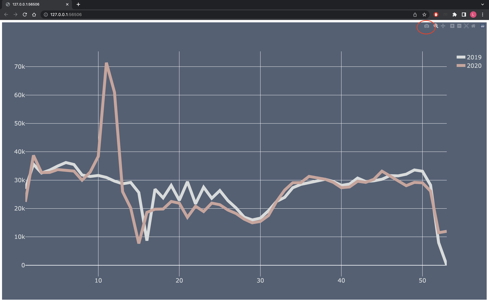

# Dataseksjonens-innedag

##
Du kan besøke dette repoet på [https://github.com/navikt/dataseksjonens-innedag](https://github.com/navikt/dataseksjonens-innedag). Repoet er åpent og du trenger ikke github-bruker for å se innholdet
eller for å clone det til raspberryen. For å clone repoet:

```
git clone https://github.com/navikt/dataseksjonens-innedag.git
```
> **NB!**
> Hvis du ikke har satt opp bruker lokalt på raspberryen, vil git be om dette. Kjør kommandoene `git config --global user.name "<BRUKERNAVN>"` og 
> `git config --global user.email "<EPOST>"`. **BRUKERNAVN** og **EPOST** kan du sette til hva du vil. 


Dette repoet inneholder data i .csv format og python scripts som henter dataen og visualiseres dataen. Dataen som ligger i [data/](data/) er et forslag til hva som kan visualiseres, dere står fritt til å bruke annen data. 
Hvis dere ønsker annen data fra SSB sitt API eller NAV sine sider, kan dere ta utgangspunkt i python-scriptene som ligger i [fetch_data/](fetch_data/). 

Repoet inneholder også eksempler på hvordan  visualisere dataen i plotly.

## Data
Dataen som ligger i [data/](data/) er offentlig data hentet fra SSB sitt API og NAV sine sider.

- [nav_sykemeldte_alle_diagnoser.csv](data/nav_sykemeldte_alle_diagnoser.csv): Totalt nye sykmeldte per uke, tidserie. Les mer [https://www.nav.no/no/nav-og-samfunn/statistikk/sykefravar-statistikk/nye-sykmeldte-per-uke](https://www.nav.no/no/nav-og-samfunn/statistikk/sykefravar-statistikk/nye-sykmeldte-per-uke).
- [nav_sykemeldte_korona.csv](data/nav_sykemeldte_korona.csv): Antall nye korona relaterte sykmeldte per uke, tidserie. Les mer [https://www.nav.no/no/nav-og-samfunn/statistikk/sykefravar-statistikk/nye-sykmeldte-per-uke](https://www.nav.no/no/nav-og-samfunn/statistikk/sykefravar-statistikk/nye-sykmeldte-per-uke).
- [ssb_ledige_stillinger.csv](data/ssb_ledige_stillinger.csv): Sesongjustert antall ledige stillinger i det norske arbeidsmarkedet. Ler mer [https://www.ssb.no/statbank/table/11587](https://www.ssb.no/statbank/table/11587).
- [ssb_sykefravaer.csv](data/ssb_sykefravaer.csv): Sykefraværsprosent, ikke-sesongjustert. Les mer [https://www.ssb.no/statbank/table/12439](https://www.ssb.no/statbank/table/12439).
- [ssb_fattigdomsproblemer.csv](data/ssb_fattigdomsproblemer.csv): Fattigdomsproblemer, levekårsundersøkelsen. Les mer [https://www.ssb.no/statbank/table/12078](https://www.ssb.no/statbank/table/12078).


### Python-scripts for å hente annen data.
Om dere vil bruke annen data fra SSB eller NAV, så kan dere ta utgangspunkt i scriptene som ligger [fetch_data/](fetch_data/) for å hente dataen.

For å kjøre scriptene, trenger dere å installere noen pakker. Det kan gjøres slik `pip3 install -r requirements.txt`.

> NB!
> Dette kan ta litt tid. 

For å kjøre scriptene kan dere kjøre kommandoen `python3 <script_navn>.py`. Scriptene kan også editeres ved å bruke nano som editor `nano <script_navn>.py`.


> **NB!**
> Hvis dere ønsker å bruke scriptene for å hente annen data, så trenger dere å erstatte verdiene til variablene **URL** og **QUERY**.
> Scriptene burde også kjøres fra øverste nivå i repoet.

## Visualisere dataen
Denne seksjonen handler om hvordan visualisere dataen.

### MagicMirror
Klone Repo til magicmirror `$ git clone https://github.com/MichMich/MagicMirror`

2. Bytt mappe `$ cd MagicMirror`

3. Installer MagicMirror med node `$ npm install --only=prod --omit=dev`

4. Kopier og ta utgangspunkt i sample config fil: `$ cp config/config.js.sample config/config.js`

5. Start MagicMirror `$ npm run start`

For å gå ut av MagicMirror, trykk **Ctrl + Q**

Dere har nå et flott utgangspunkt til et supert magisk speil.

#### MagicMirror Moduler


Her er noen MagicMirror moduler som kan brukes for å visualisere noe data.

| Modulnavn  | Beskrivelse |
|------------| ----------- |
| MMM-Slack2 | Går gjennom de nyeste slackmeldingene i en kanal     |
| MMM-SlackAnnouncements | Skriv meldinger til MagicMirror fra en bestemt slack kanal     |
|MMM-JsonGraph | Stolpediagram basert på en json liste |
|MMM-JsonTable | Tabell basert på en json liste |
|MMM-json | Vis hele eller deler av en json response|

For mer inspirasjon, gå til listen over tredjeparts moduler for MagicMirror [https://github.com/MichMich/MagicMirror/wiki/3rd-party-modules](https://github.com/MichMich/MagicMirror/wiki/3rd-party-modules).

### Python og plotly
I mappen [visualize_data/](visualize_data) finner du to python scripts som visualiserer noe data. Dette er ment som eksempler som dere kan ta utgangspunkt i.
Hvis dere vil teste **plolty_scatter_graph.py** scriptet, så kan dere kjøre kommandoen : `python3 visualize_data\plolty_scatter_graph.py`. 

Dere vil da få opp
et vindu i nettleseren med grafen. Hvis dere ikke ønsker å vise grafen i nettleseren kan dere også lagre grafen som png ved å trykke på **download as png** øverst i høyre hjørne i nettleseren. 




## Spørsmål
Hvis dere har noen spørsmål, ikke nøl med å spørre noen fra komiteen. 